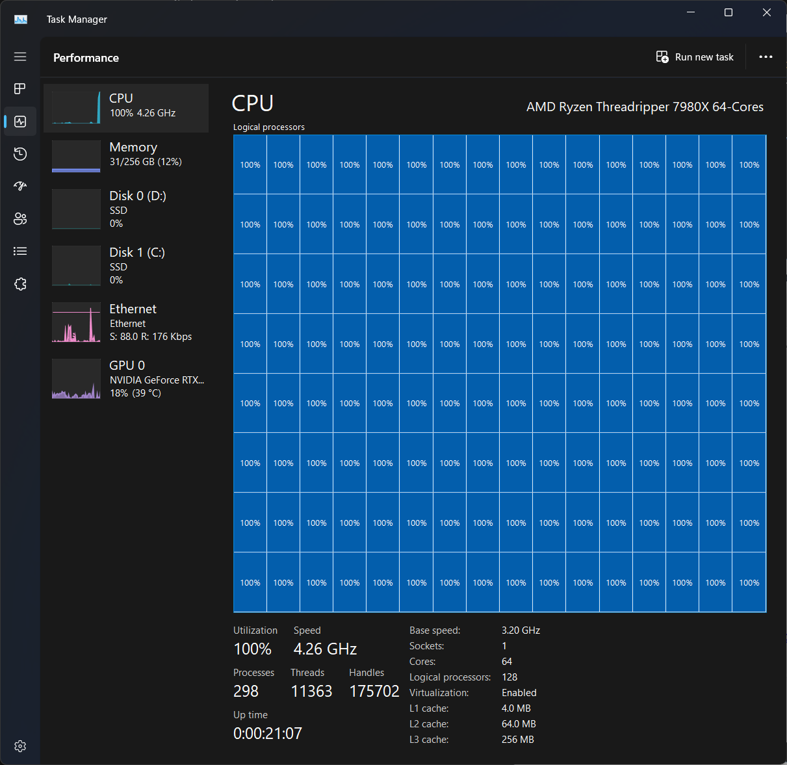

## Support more than 64 cores

If you want to use more than 64 cores in WSL2 (e.g. if you have AMD Threadripper 7980x), you can follow the steps:

### Build `computecore.dll` for WSL2

1. Generate project

        mkdir build
        cd build
        cmake ..

1. Open `build/Project.sln` and generate a x64 release build.

1. Launch task manager, kill `wslservice.exe` process.

1. Copy the generated `build/Release/computecore.dll` to `C:\Program Files\WSL\`.

1. Launch any WSL2 distribution, type `nproc` or `lscpu`, you should see all cores.

### Change hypervisor scheduler type

Now you can see all cpus in WSL2, but actually, you might still can't use all of them. For example, if you run:

    make -j`nproc`

from task manager, you might still see only 50% cpus are working. That because the default hyperV scheduler is `Root`,
all tasks are still not scheduled cross all cpu groups. You can run the following command from powershell console to
check your current hyperV scheduler:

    Get-WinEvent -FilterHashTable @{ProviderName="Microsoft-Windows-Hyper-V-Hypervisor"; ID=2} -MaxEvents 1

If it outputs `Hypervisor scheduler type is 0x4`, it means you are using Root scheduler. You need run the following
command to change the scheduler type to `Core`:

    bcdedit /set hypervisorschedulertype Core

Restart machine to take the settings effect. Note, if you enable bitlocker, you might need input the bitlocker key
after restarting. So please save your bitlocker key before restarting.

Now, you can use full cores really!

